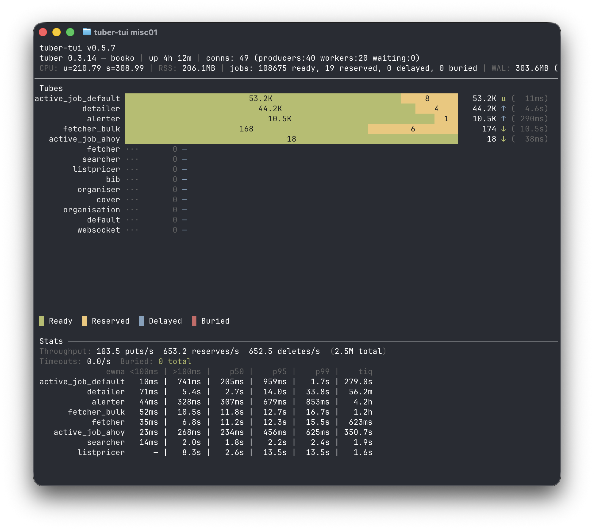

# tuber-tui

A real-time terminal dashboard for [tuber](https://github.com/dkam/tuber), a Rust job queue server.



## Features

- Live server stats: version, uptime, connections, CPU usage, drain status
- Per-tube stacked bar chart with log-scaled segments for ready, reserved, delayed, and buried jobs
- Throughput rates: puts/s, reserves/s, deletes/s, timeouts/s
- Processing time EWMA per tube
- Buried job highlighting
- Auto-reconnect on connection loss

## Install

```
cargo install --path .
```

## Usage

```
tuber-tui --addr localhost:11300
```

| Flag         | Default          | Description             |
|--------------|------------------|-------------------------|
| `--addr`     | `localhost:11300`| Tuber server address    |
| `--interval` | `1.5`            | Poll interval (seconds) |

Press `q` to quit.

## Layout

```
+------------------------------------------------------+
| Top bar: version, uptime, connections, CPU, drain    |
+------------------------------------------------------+
| Tube bar chart (log-scaled, color-coded)             |
|                                                      |
|  emails   ████████████████████████           12,345  |
|  webhooks ██████████████                        567  |
|  default  ████                                   23  |
|                                                      |
|  █ Ready  █ Reserved  █ Delayed  █ Buried            |
+------------------------------------------------------+
| Throughput rates, EWMA, buried count                 |
+------------------------------------------------------+
```

## Requirements

- A running [tuber](https://github.com/dkam/tuber) server
- Rust 1.75+

## License

MIT
